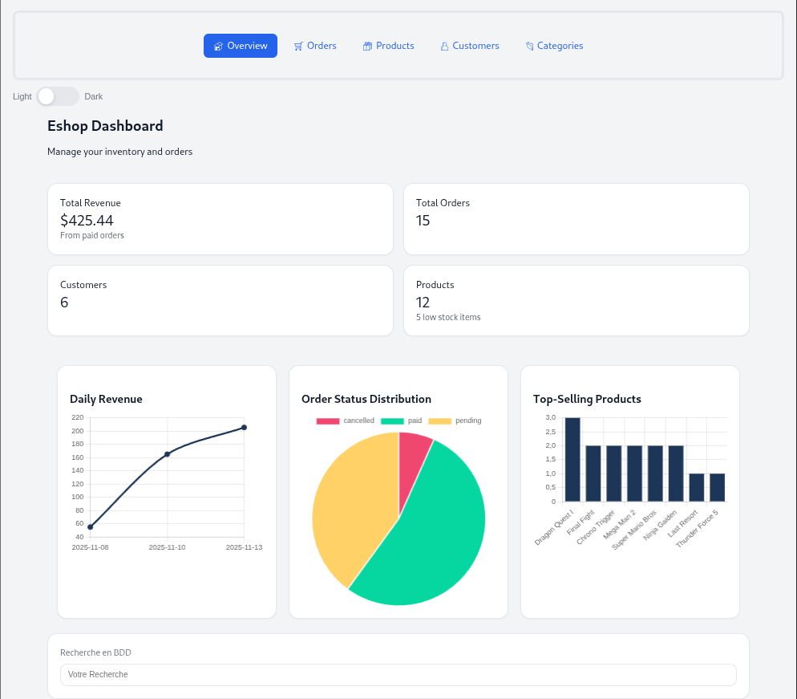

# Presentation de l'application

# PANEL ADMIN

Un panel d'administration pour gérer un e-shop avec architecture MVC. 
Il permet de gérer les catégories, produits, clients, commandes et statistiques. Le projet inclut un système de migration de base de données pour faciliter les mises à jour.

## Fonctionnalités

- **Gestion complète des catégories et produits**
- **Gestion des clients et de leurs informations**
- **Gestion des commandes (un produit par commande)**
- **Recherche et filtrage des données (directement en base de données pour la recherche globale sur la page des stats.html et au niveau de l'affichage pour les autres pages)**
- **Export des données (Implémentation en cours)**
- **Statistiques et rapports** 

## Technologies Utilisées

- **PHP 8+**
- **SQLite comme base de données légère**
- **HTML / CSS / JavaScript pour le front-end**
- **PHP pour le back-end**
- **Architecture MVC(Model-View-Controller)**
- **Outil de migration personnalisé : tonton**

# Installation

1. **Cloner le dépôt GIT**

git clone https://github.com/julien-alaria/eshop

2. **Lancer un serveur PHP local (depuis le dossier du projet)**

php -S localhost8000 -t public

le fichier stats.php est le point d'entrée de l'application

3. **Accéder à l'application dans votre navigateur:**

# Architecture du projet (MVC)

L'application suit le modèle MVC en séparant:

- **models :** la logique métier et les interactions avec la base SQLite
- **views :** les pages HTML
- **controllers :** la gestion des requêtes utilisateur
- **routeur :** gestion des actions via les URLs

# Captures d'écran de l'application



## Structure du Projet

back/
 ├─ migration/            # Scripts de migration
 ├─ public/index.php      # Point d'entrée
 ├─ src/
 │   ├─ controllers/      # Contrôleurs
 │   ├─ helpers/          # Fonctions utilitaires
 │   └─ models/           # Modèles
 ├─ database.sqlite       # Base de données SQLite
 ├─ structure.sql         # Structure initiale de la base de données
 ├─ MIGRATIONS.md         # Historique des migrations
 ├─ tonton                # Outil de migration
front/
 ├─ assets/               # JS
 ├─ css/
 ├─ views/                # Pages HTML
README.md


# Starter kit de Tonton
## Migrations (Tonton)

Depuis back/ :

### Appliquer les migrations en attente

```
php tonton migrate
```

### Créer une migration

```
php tonton make:migration create_new_table
```

### Rollback (1 ou N)

```bash
php tonton rollback
php tonton rollback 2
```

# Licence
Ce projet est open-source, sous licence MIT.